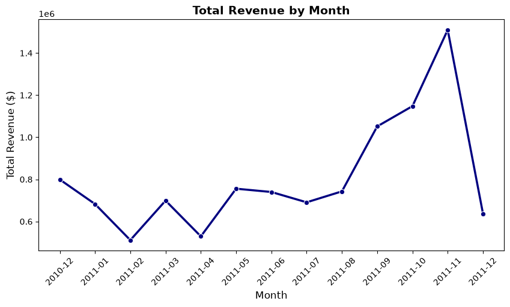
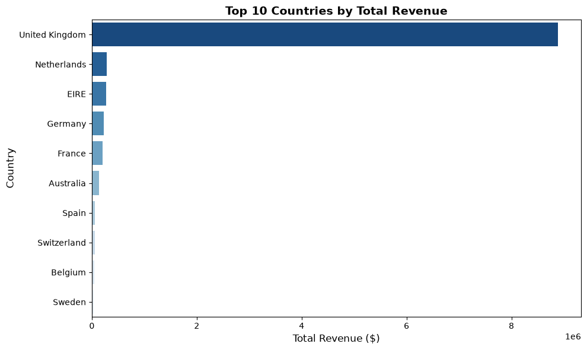

# 🛍️ NovaRetail — Exploratory Data Analysis

Exploratory Data Analysis on transactional data from a UK-based online retailer,
covering sales trends, customer segmentation, and product performance.

## 📊 Key Insights
- **Revenue Peak:** November generates the highest revenue, driven by holiday demand.
- **Geographic Market:** The UK accounts for the majority of sales, with secondary
  growth opportunities in the Netherlands, Ireland, and Germany.
- **Customer Concentration:** The top 20% of customers generate ~72% of total revenue
  (Pareto Principle) — highlighting the need for VIP retention programs.
- **Product Strategy:** High-volume items are low-cost novelty products, while
  high-revenue items are premium decor sets — an opportunity for bundling.

## 🧰 Tools
Python · Pandas · NumPy · Matplotlib · Seaborn · Jupyter Notebook

## 📁 Project Structure
- `NovaRetail_Data_Analysis.ipynb` — full analysis notebook (cleaning, EDA, visuals)
- `images/` — exported charts

## 🔍 What the notebook covers
1. Data cleaning (missing values, invalid prices, cancellations, duplicates)
2. Sales performance over time (monthly, daily, hourly trends)
3. Customer analysis (top spenders, order frequency, Pareto/80-20 analysis)
4. Product analysis (best-sellers by volume and by revenue)

## 📌 Dataset
[Online Retail Dataset](https://archive.ics.uci.edu/dataset/352/online+retail) — UCI Machine Learning Repository

## 🚀 How to run
\`\`\`bash
pip install -r requirements.txt
jupyter notebook NovaRetail_Data_Analysis.ipynb
\`\`\`

## 📷 Sample Visuals

## 📬 Connect
[LinkedIn](#) · [[Kaggle](https://www.kaggle.com/ahmedshanaa)](#)
